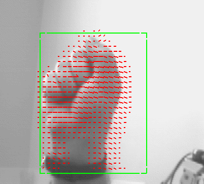

# object-detection-tracking

Esta demo muestra cómo se puede usar un modelo de detección de objetos para detectar diferentes elementos en un video. En este caso, se utiliza un modelo de detección de objetos de [yolov4-tiny](https://github.com/AlexeyAB/darknet) para detectar objetos.

YOLO (You Only Look Once) es una de las arquitecturas de tipo One-Shot más populares en la actualidad por su rapidez y su precisión.

Para ejecutar la demo en local, sigue los siguientes pasos:

## 1. Clona el repositorio

Abre una terminal y ejecuta el comando:

```sh
git clone https://github.com/diecalsa/object-detection-tracking.git
```

Deberá crearse una carpeta llamada `object-detection-tracking` en el directorio actual.

Una vez descargada, ejecuta el comando:

```sh
cd object-detection-tracking
```

De esta forma, accedemos a la carpeta.

## 2. Instala las dependencias

Para instalar las dependencias lo ideal es crear un entorno virtual de conda o virtualenv. Para ello:

**Conda**
```sh
conda create -n object-detection-tracking python=3.8
```

Una vez creado el entorno, actívalo:

```sh
conda activate object-detection-tracking
```

Finalmente, instala las dependencias:

```sh
pip install -r requirements.txt
```

## 3. Ejecuta la demo

Una vez instaladas las dependencias en el entorno virtual, desde la carpeta de la demo ejecuta el comando:

```sh
python src/app.py --labels_file src/model/coco.names --min_score 0.3
```

Si todo ha ido bien, aparecerá una ventana que muestra la webcam y los objetos detectados en la imagen.

El modelo que se está utilizando en esta demo es el `yolov4-tiny` que ha sido entrenado con la base de datos de [COCO](https://cocodataset.org/#home). Este conjunto de datos contiene una gran cantidad de objetos de diferentes tipos (80 en concreto), incluyendo coches, personas, etc. En el archivo `src/model/coco.names` se encuentra la lista de los objetos que se pueden detectar.

## 4. Tracking de Objetos mediante Optical Flow

[Optical Flow](https://en.wikipedia.org/wiki/Optical_flow) es un método de cálculo de velocidad de un objeto en una imagen que permite "trackear" el movimiento de un objeto en la imagen. En aplicaciones de detección de objetos se suele utilizar este método de forma alterna con la detección de modelos deep learning para aumentar la estabilidad del sistema de detección.



Dada una imagen y la bounding box detectada, se puede predecir la posición del objeto en una nueva imagen calculando los gradientes de la misma.

En la demo actual, es posible cambiar del modo "detección" a "tracking" mediante el teclado pulsando las siguientes teclas:

| Tecla | Algoritmo |
|------|-----------|
| `t`  | TLD |
| `f`  | Median Flow |
| `k`  | KCF |
| `m`  | Mosse |
| `c`  | CSRT | 
| `i`  | MIL |
| `b`  | Boosting |
| `d`  | Detección |
| `q`  | Salir |

NOTA: Para más información sobre los algoritmos de tracking [haz click aquí](https://pyimagesearch.com/2018/07/30/opencv-object-tracking/).